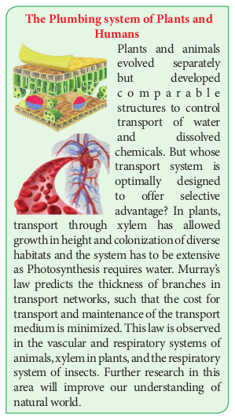

# 11.1 Types of Transport

Transport is the process of moving water,minerals and food to all parts of the plant body. Conducting tissues such as xylem and phloem play an important role in this.

What is the need for transport? Water absorbed from roots must travel up to leaves by xylem for food preparation by photosynthesis. Likewise, food prepared from leaves has to travel to all parts of the plant including roots. Both the processes are interconnected and depend on each other.

Based on the distance travelled by water (sap) or food (solute) they are classified as (a) Short distance (Cell to cell transport) and (b) Long distance transport.

i. **Short-distance (Cell to cell transport):**
Involvement of few cells, mostly in the lateral direction. They are the connecting link to xylem and phloem from root hairs or leaf tissues respectively. Examples: Diffusion, Imbibition, and Osmosis.

ii. **Long-distance transport:**
Transport within the network of xylem or phloem is an example for long-distance transport. Examples: Ascent of Sap and Translocation of Solutes.

Based on energy expenditure during transport, they are classified as **(a) passive transport and (b) active transport.**

i. **Passive transport:**
It is a downhill process which utilizes physical forces like gravity and concentration. No energy expenditure is required. It includes diffusion, facilitated diffusion, imbibition, and osmosis.

ii. **Active transport:**
It is a biological process and it runs based on the energy obtained from respiration. It is an uphill process.
